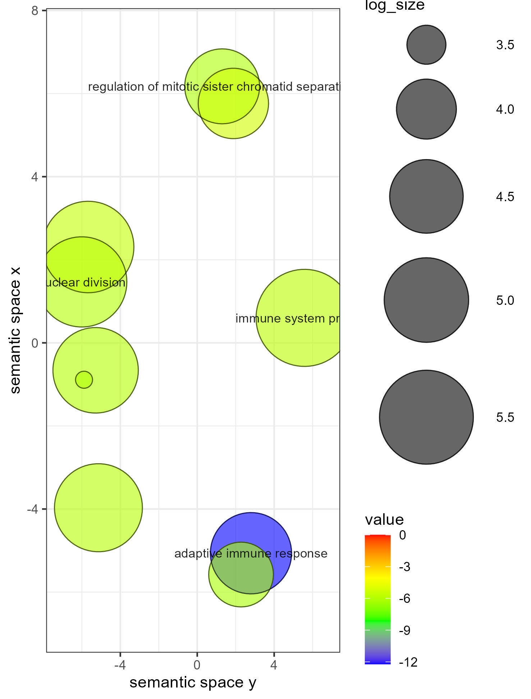

```{r setup, include=FALSE}
knitr::opts_chunk$set(
	echo = FALSE,
	message = FALSE,
	warning = FALSE
)
```
# Abstract

Este estudio presenta un análisis transcriptómico comparativo de muestras de sangre periférica procedentes de pacientes con COVID-19, infecciones bacterianas e individuos sanos, utilizando datos del estudio de McClain et al. El objetivo principal del estudio fue identificar la firma molecular específica de la infección por SARS-CoV-2 y los procesos biológicos. 

En nuestra exploración tras un preprocesamiento y normalización de datos de RNA-seq, se realizó un análisis de expresión diferencial mediante modelos lineales. Los resultados revelaron una respuesta inmunitaria distintiva en COVID-19, una menor expresión génica en comparación a las infecciones bacterianas. Sin embargo, los genes sobreexpresados mostraron un enriquecimiento significativo en la respuesta inmune adaptativa y la regulación del ciclo celular. Estos hallazgos sugieren que, a pesar de una supresión transcriptómica generalizada, existe una activación específica de mecanismos de defensa celular y división nuclear esenciales para la respuesta del huésped ante el virus.

# Objetivos

El propósito central de este trabajo es caracterizar la respuesta molecular y célular del paciente frente a la infección por SARS-CoV-2 mediante técnicas de bioinformática y estadística. Los objetivos específicos son:

+ Identificar patrones de agrupamiento y posibles fuentes de variación técnica (efecto batch) mediante técnicas de reducción de la dimensionalidad.

+ Identificar genes diferencialmente expresados. Determinar la firma de expresión específica de pacientes con COVID-19 y compararla con la respuesta ante infecciones bacterianas para discernir patrones comunes y exclusivos.

+ Caracterizar funcionalmente la respuesta biológica. Interpretar biológicamente los genes identificados mediante el análisis de enriquecimiento.


# Métodos

Los datos analizados provienen de un subconjunto del estudio clínico de McClain et al., depositado en repositorios públicos de expresión génica. La naturaleza de los datos es transcriptómica, obtenida mediante RNA-seq de sangre periférica. El dataset original incluye recuentos de lecturas, junto con metadatos clínicos.que categorizan a los individuos en tres grupos: COVID-19, infección bacteriana y controles sanos.

Se utiliza el paquete SummarizedExperiment para la gestión de datos y metadatos. Se aplicó un filtrado de genes con baja expresión para reducir el ruido y tener en cuenta genes con expresión real. La normalización se realizó mediante transformación logarítmica para estabilizar la varianza. 

Empleamos el Análisis de Componentes Principales (PCA) y Heatmaps para evaluar la homogeneidad de los grupos y visualizar diferencias según variables categóricas. Acorde a esto definimos la matriz de diseño y contrastes. 

Se utiliza la librería voom-lima, fijando un umbral de P.adj < 0.05 y logFC de 1.5.Para la interpretación biológica, se utiliza el paquete topGO. 

Durante el análisis se incluyen gráficos asociados a los distintos objetos, generados por las funciones de las própias librerias o utilizando ggplot2.

# Introducción

Los archivos y el código generado para realizar los análisis posteriores se encuentran en el repositorio llamado "Analisis-Datos-Omicos---PEC-2" al que se puede acceder mediante el siguiente enlace https://github.com/bruniix/Analisis-Datos-Omicos---PEC-2.

Para dicha resolución se ha trabajado con R y utilizando RMarkdown para la escritura y ejecución.

# Obtención de los datos

En primer lugar, tal como se indica en la propuesta del ejercicio, los datos de el estudio se encuentran en la plataforma Gene Expression Omnibus mediante el identificador [GSE161731](https://www.ncbi.nlm.nih.gov/geo/query/acc.cgi?acc=GSE161731).

Como se describe en la plataforma, en el estudio dispusieron de 46 pacientes con COVID-19 alguno de ellos tomando varias muestras en momentos distintos llegando al número total de 77 muestras de sangre periférica.

Para la comparación transcriptómica y de la expressión génica compararon las muestras con las almacenadas de otros pacientes diagnosticados con infección respiratoria aguda debída a coronavirus estacional, al virus de la gripe, neumonía bacteriana o pacientes control.

Además los pacientes de estudio fueron divididos en grupos según la gravedad de la infección aparente debido a lo sintomas expresados y mediante tiempo en relación al desarrollo de la enfermedad.

Para empezar vamos a descargar los datos mediante el paquete GEOquery que nos permite acceder directamente a la base de datos.

```{r}
#carga de librerias y paquetes

if (!requireNamespace("BiocManager", quietly = TRUE))
    install.packages("BiocManager")

paquetes <- c("GEOquery", "SummarizedExperiment", "EnsDb.Hsapiens.v86", "GenomicFeatures", "edgeR")
for (p in paquetes) {
    if (!requireNamespace(p, quietly = TRUE))
        BiocManager::install(p)
    library(p, character.only = TRUE)
}


```

## Descarga datos GEO, preparación datos contaje y metadatos

```{r}

DATA <- getGEO("GSE161731")

DATA[[1]]

cat("Habiendo descargado los datos mediante el paquete GEOquery, obtenemos eluna lista que contiene ub objeto de tipo:",class(DATA[[1]]))


cat("\n Utilizando la funcion experimentData() visualizamos la información asociada al caso de GEO y el enlace para realizar lad escarga de los datos de expresión 'assay data'.")

download.file("https://ftp.ncbi.nlm.nih.gov/geo/series/GSE161nnn/GSE161731/suppl/GSE161731_counts.csv.gz", destfile = "GSE161731_GEO_submission_counts.txt.gz")

count_matrix <- read.csv("GSE161731_GEO_submission_counts.txt.gz", header = FALSE, row.names = 1)

colnames(count_matrix) <- count_matrix[1,]

count_matrix <- count_matrix[-1, ]

count_matrix <- as.matrix(count_matrix)

cat("\n Las dimensiones del objeto descargado que contiene los datos de expresión son:",dim(count_matrix), "\n Podemos hacernos una idea de la distribución de los datos viendo la expresión genica para algunas de las muestras.")

knitr::kable(count_matrix[1:10, 1:10])

metadata <- pData(DATA[[1]])

cat("\n Las dimensiones del objeto importado de la base de datos de GEO \n, que contiene los metadatos (información en relación a las muestras y los pacientes) son", dim(metadata), "Podemos hacernos una idea de la distribución de los datos viendo los registros para algunas muestras.")


```

Vemos que los metadatos importados de la base de datos GEO tienen su identificador própio, lo que nos impide relacionarlos con las muestras correspondientes. Modificamos el nombre de las filas para que corresponda con los carácteres de interés de la variable "titulo".

```{r}
library(tidyverse)
rownames(metadata) <- str_sub(metadata$title, 14)
```

Para preparar el objeto SummarizedExperiment debemos en primer lugar asegurar que disponemos de información para las muestas de las cuales se ha obtenido el trasnscriptoma y la anotación genica para los genes cuantificados.

Ya hemos visto que las dimensiones eran distintas para ambos objetos, por lo que cabe suponer que hay 3 muestras de las cuales no se dispone información (ncol(count_matrix)-nrow(metadata)).

```{r}
muestras <- intersect(rownames(metadata), colnames(count_matrix))

cat("Al haber realizado la intersección tenemos el mismo identificador, y por tanto información completa, para un total de", length(muestras)," muestras.")

count_filtrado <- count_matrix[, muestras]
metadata_filtrado <- metadata[muestras, ]

count_filtrado <- as.matrix(count_filtrado)
storage.mode(count_filtrado) <- "numeric"

```

## Descarga datos genes y filtrado según genes en común

```{r}
#genes rowranges 

gene_ranges <- genes(EnsDb.Hsapiens.v86)

gene_ids <- rownames(count_filtrado)

gene_ids_annotation <- names(gene_ranges)

gene_comun <- intersect(gene_ids, gene_ids_annotation)

count_filtrado <- count_filtrado[gene_comun, ]
gene_ranges_final <- gene_ranges[gene_comun]

cat("Después de haber seleccionado los genes y carácteristicas comunes las dimensiones de la matriz de contajes quedan siendo: ", dim(count_filtrado))

```

## Creación obtejo SummarizedExperiment

Una vez tenemos la matriz de contajes con las observaciones correspondientes, los metadatos con el nombre de fila correcto y hemos comprobado la coincidencia y orden correcto, podemos crear el objeto SummarizedExperiment para conseguir tener todos los datos enlazados.

```{r}
se <- SummarizedExperiment(
    assays = list(counts = count_filtrado),
    colData = metadata_filtrado,
    rowRanges = gene_ranges_final
)

print(se)


```

Como se observa al mostrar el SummarizedExperiment, está formado por 57602 genes a los cuáles se dispone de registro de expressión para 194 muestras, con 67 columnas con información de los metadatos y 6 variables en relación a los genes.

# Limpieza y selección de datos

## Selección de cohorte

En primer lugar seleccionamos la variables de interés para los metadatos y cambiamos el nombre para mejor interpretación.

```{r}


col_metadata_select <- c("title", "geo_accession", "age:ch1", "batch:ch1", "cohort:ch1", "gender:ch1", "hospitalized:ch1", "race:ch1", "subject_id:ch1", "time_since_onset:ch1")

colData(se) <- colData(se)[, col_metadata_select]

cat("Columnas de metadatos seleccionadas:\n")

colnames(colData(se))[3:10] <- c("age", "batch", "cohort", "gender", "hospitalized", "race", "id", "time_since_onset")

colnames(colData(se))

str(colData(se))

```

Seleccionamos las cohortes en las que estamos interesados, cogeremos solo las muestras que corresponden clasificadas como: COVID19, Bacterial y healthy.

```{r}
library(tidyverse)

cat("Actualmente las clasificaciones para las variables de la cohorte son:\n", unique(colData(se)$cohort))

cohortes_seleccionadas <- c("COVID-19", "Bacterial", "healthy")

se <- se[, se$cohort %in% cohortes_seleccionadas]


table(se$cohort)


```

Vemos que del número inicial de muestras quedan 117 según las cohortes y pacientes con el estado inmunológico de interés-

## Revisión datos

A continuación antes de passar al análisis de los datos, revisamos que no hayan individuos repetidos y que las variables sean del tipo que corresponde

```{r}
cat("El número de identificadores de las muestras y de entradas coincide:", length(colnames(se)) == length(unique(colData(se)$id)) )

se <- se[, !duplicated(se$id)]

cat("Habiendo eliminado los duplicados, ahora el número total de observaciones / muestras es de:", length(colnames(se)))

colnames(se) <- se$id

```

Eliminamos espacios en blanco de la variable raza y cambiamos el tipo de variable: edad a númerica y batch, cohorte, genero y raza a factor.

```{r}
colData(se)$race <- gsub(" ", "_", colData(se)$race)

variables_categoricas <- c("batch", "cohort", "gender", "race")

colData(se)[variables_categoricas] <- lapply(colData(se)[variables_categoricas], as.factor)

se_backup <- se

```

Al transformar la variable edad a númerica aparece el aviso de que se han introducido valores NA's. Buscamos los valores únicos para observar cuales no pueden ser asociados a un número entero.

```{r}
cat("Todos los valores de la variable 'age' :", unique(se$age))

table(se$age)

cat("El valor que se introduce como NA es la edad registrada como >89, puesto que es la única observación transformamos este número a 89 entero.")

se$age <- gsub(">89", "89", se$age)

se$age <- as.numeric(se$age)

summary(se$age)

```

## Semilla aleatoria y selección de muestras.

```{r}
myseed <- sum(utf8ToInt("brunobelgomez"))
cat("La semilla generada para la selección aleatoria de los datos es:", myseed)

set.seed(myseed)
select <- sample(1:ncol(se), 75)
se <- se[, select]

cat("Posterior a la selección aleatoria la distribución de muestras queda de la siguiente manera.")
table(se$cohort)


se_backup <- se

```

# Preprocesado, selección genes y transformación

## Filtrado de genes

Antes de realizar el análisis y clasificación debemos hacer una selección de los genes a contabilizar. Genes con una muy baja expresión o sin expresión no son relevantes para realizar la comparación entre grupos de distinta cohorte.

Para ello utilizamos el paquete de Bioconductor edgeR, de este podemos utilziar la función cpm() para visualizar los contajes por millón y filtrar. Una función útil del paquete utilizado es la función filterByExpr() la cual realiza el cálculo mencionado anteriormente y simultáneamente seleccióna las filas o genes a seleccionar. 

```{r}
library(edgeR)

se_backup <- se

conservar <- filterByExpr(assay(se), group = se$cohort)

se_filtrado <- se[conservar,]

cat("\n Habiendo filtrado los genes con una menor o nula expresión \n nos queda el siguiente resumen el objeto:\n")

summary(se_filtrado)


```

## Normalización

A continuación, habiendo seleccionado los genes expresados, es necesario normalizar los recuentos para que las observaciones sean comparables. Para ello utilizamos las funciones de edgeR para tener presente las lecturas de la secuenciación y buscar un factor para igualar la matriz de conteos. Con esto pretendemos que la diferencia sea únicamente biológica y no de carácter técnico. Realizamos la normalización mediante el contaje por millon y aplicamos escala logaritmica para minimizar las diferencias y que el rango de los datos sea menor, por lo tanto más comparable.

```{r}

dge <- DGEList(counts = assay(se_filtrado, "counts"))

dge <- calcNormFactors(dge)

log_counts <- cpm(dge, log = TRUE)

assay(se_filtrado, "log_counts") <- log_counts

```

# Análisis exploratorio

## PCA

En primer lugar para visualizar la distribución de los datos generamos un análisis de componentes principales. Podemos utilizar el paquete factoextra para visualzar fácilmente las muestras y sus características.

```{r}
library(factoextra)
PCA <- prcomp(t(assay(se_filtrado, "log_counts")), scale = TRUE)
fviz_eig(PCA, 
         addlabels = TRUE,       
         ylim = c(0, 30),        
         main = "Varianza explicada por cada componente principal")

```

Grácias al gráfico anterior entendemos que dimensiones o ejes explican la variabilidad de la expressión, ya normalizada y en escala logarítmica.

Con el primer y segundo componente principal ya obtenemos un 40% de toda la variabilidad, lo cuál es considerable para poder gráficar y observar la distribución de las muestras. En caso de requerir información adicional podemos tener en cuenta hata la 3a y 4a dimensión.

```{r}
fviz_pca_ind(PCA)
```

En primer lugar, al visualizar la distribución de las muestras en las dos dimensiones graficadas vemos una muestra atípica que impide una correcta visualización y muede sesgar el análisis. Procedemos a eliminarla y visualizar los componentes principales según algunas de las variables de interés como la cohorte, la raza o el sexo.

### Cohorte

```{r}
se_filtrado <- se_filtrado[, colnames(se_filtrado) != "896282"]

PCA <- prcomp(t(assay(se_filtrado, "log_counts")), scale = TRUE)

fviz_pca_ind(PCA, habillage = se_filtrado$cohort)

```

En primer lugar por lo que respecta a la cohorte o el grupo clínico al que los pacientes estaban asociados vemos una separación clara para el primer componente principal ente individuos con una infección bacteriana frente a una infección vírica como el Sars-CoV2 y los individuos sanos. De los pacientes del estudio con COVID-19 y los sanos no se puede ver una separación en etos componentes.

### Raza

```{r}
se_filtrado <- se_filtrado[, colnames(se_filtrado) != "896282"]

PCA <- prcomp(t(assay(se_filtrado, "log_counts")), scale = TRUE)

fviz_pca_ind(PCA, habillage = se_filtrado$race)

```

Por lo que refiere a la entina de los pacientes no se ve una división en los componenetes. Si bien es cierto que parece que pacientes africoamericanos son más presentes en una región respecto al eje principal podría ser debido a sesgo durante la obtención de las muestras para el banco.

### Sexo

```{r}
se_filtrado <- se_filtrado[, colnames(se_filtrado) != "896282"]

PCA <- prcomp(t(assay(se_filtrado, "log_counts")), scale = TRUE)

fviz_pca_ind(PCA, habillage = se_filtrado$gender)


```

No se observa ningúna distribución según el sexo de los pacientes.

### Batch

```{r}
se_filtrado <- se_filtrado[, colnames(se_filtrado) != "896282"]

PCA <- prcomp(t(assay(se_filtrado, "log_counts")), scale = TRUE)

fviz_pca_ind(PCA, habillage = se_filtrado$batch)

table(se_filtrado$batch)

```

Si bien es cierto que parece haber una distribución en la variabilidad debida al primer componente principal para muestras del segundo batch, debido a la diferencia de número de muestras entre ambos grupos y la presencia heterogenea del primer batch no podemos afirmar diferencias.

## Heatmap y clustering

Teniendo presente la agrupación de las muestras por lo que refiere a variabilidad realizamos un agrupamiento jerárquico según las similitudes de las muestras.

```{r}
library(pheatmap)
library(matrixStats) 

rv <- rowVars(assay(se_filtrado, "log_counts"))
select_genes <- order(rv, decreasing = TRUE)[1:100] 

mat <- assay(se_filtrado, "log_counts")[select_genes, ]

columnas_deseadas <- c("age", "batch", "cohort", "gender")
columnas_reales <- columnas_deseadas[columnas_deseadas %in% colnames(colData(se_filtrado))]
df <- as.data.frame(colData(se_filtrado)[, columnas_reales])


rownames(df) <- colnames(se_filtrado)

pheatmap(mat, 
         show_rownames = FALSE, 
         show_colnames = FALSE,
         scale = "row",                
         annotation_col = df, 
         clustering_method = "ward.D2", 
         clustering_distance_cols = "euclidean",
         color = colorRampPalette(c("navy", "white", "firebrick3"))(100), 
         main = "Top 100 Genes más Variables",
         border_color = NA            
)
```

Al visualizar miles de genes se genera un mapa demasiado saturado donde no es posible obtener información relevante. En este caso hemos expresado los 100 genes más variables. De el clustering y mapa de calor podemos obtener ides similares a las obtenidas mediante el PCA.

Hay más similitud entre muestras o individuos que comparten cohorte y cierta coincidencia con la etnia de origen. En este caso si que se aprecian diferencias en la expresión para el genero, dentro de cada gran grupo del clustering hay un cambio marcado según si las muestras pertenecen a un paciente masculino o femenino, por lo que está característica resulta relevante.

Por lo que refiere a la edad, aunque no se configura un patrón claro, para la expresión dentro de los grupos generados parece observarse un cambio en la cuantificaicón según la edad a la que pertenecen. Además, siguiendo los conocimientos biológicos disponibles, podemos asumir que el estado fisiológico e inmunitario de un individuo puede ir relacionado con la edad, y por lo tanto la respueta frente a una infección.

# Expresión diferencial

Habiendo explorado los datos y las variables de interés procedemos con el análisis de expresión diferencial.

```{r}
set.seed(myseed)
cat("El método seleccionado para el análisis según la semilla generada anteriormente es:", sample(c("edgeR", "voom+limma", "DESeq2"), size = 1))
```

En primer lugar creamos la matriz de diseño con las variables de interés: cohorte, sexo, etnia y edad. Y aplicamos el modelo voom lima para ver desviación de la media respecto a los contajes transformados.

```{r}

dge <- DGEList(counts = assay(se_filtrado, "counts"))

dge <- calcNormFactors(dge)

sexo <- se_filtrado$gender
cohort <- se_filtrado$cohort
age <- se_filtrado$age
se_filtrado$race <- droplevels(se_filtrado$race)
race <- se_filtrado$race
matriz <- model.matrix(~0 + cohort + race + sexo + age)

colnames(matriz)

v <- voom(dge, matriz, plot = TRUE)


```

Mencionar que hemos limpiado los niveles de la variable categórica etnia, ya que había configurado un nivel que no ha sido seleccionado en nuestro subgrupo.

Al haber utilizado la función voom vemos el gráfico esperable. Con un mayor contaje de la expresión (formato log2) obtenemos una menor desviación estándar y por lo tanto mayor estabilidad.

Ajustamos al modelo lineal y definimos los contrastes a realizar en una matriz de contrastes, en este caso Bacterial vs Healthy y COVID-19 vs Healthy. Luego ajustamos el modelo a dichos contrastes.

```{r}
fit <- lmFit(v, matriz)

colnames(matriz) <- make.names(colnames(matriz))

colnames(matriz)

contrastes <- makeContrasts(
  COVID_vs_Healthy = cohortCOVID.19 - cohorthealthy, 
  Bacterial_vs_Healthy = cohortBacterial - cohorthealthy,
  levels = matriz
)

cat("La matriz de contrastes es: \n")

contrastes

fit2 <- contrasts.fit(fit, contrastes)

fit2 <- eBayes(fit2)


```

## Comparativa COVID19 vs Healthy / Bacterial vs Healthy

```{r}

res_covid <- topTable(fit2, coef = "COVID_vs_Healthy", number = Inf, sort.by = "P")

cat("Primeras observaciones de los resultados de la comparación COVID vs Healthy: \n")

head(res_covid)


res_bacterial <- topTable(fit2, coef = "Bacterial_vs_Healthy", number = Inf, sort.by = "P")

cat("Primeras observaciones de los resultados de la comparación Bacterial vs Healthy: \n")


head(res_bacterial)


cat("Utilizamos la función decidetest() para ver que genes está sobreexpresados \n o por debajo para ambas comparaciones. Establecemos los parametros lfc a 1.5 y p.value a 0.05 \n")

summary(decideTests(fit2, lfc = 1.5, p.value = 0.05))


```

### Visualización COVID vs Healthy

```{r}
library(ggplot2)

res_covid$diff_status <- "No significativo"

res_covid$diff_status[res_covid$logFC > 1.5 & res_covid$adj.P.Val < 0.05] <- "Up-regulated"

res_covid$diff_status[res_covid$logFC < -1.5 & res_covid$adj.P.Val < 0.05] <- "Down-regulated"

ggplot(res_covid, aes(x = logFC, y = -log10(adj.P.Val), color = diff_status)) +
  geom_point(alpha = 0.5, size = 1.5) +  # Puntos con cierta transparencia
  scale_color_manual(values = c("Down-regulated" = "blue", 
                                "No significativo" = "grey", 
                                "Up-regulated" = "red")) +
  
  geom_vline(xintercept = c(-1.5, 1.5), linetype = "dashed", color = "black", alpha = 0.5) +
  geom_hline(yintercept = -log10(0.05), linetype = "dashed", color = "black", alpha = 0.5) +
  
  labs(title = "Volcano Plot: COVID-19 vs Healthy",
       subtitle = "Umbrales: |logFC| > 1.5 y Adj. P-Value < 0.05",
       x = "Log2 Fold Change",
       y = "-Log10 Adjusted P-Value",
       color = "Estado") +
  theme_minimal()


```

### Visualización Bacterial vs Healthy

```{r}
library(ggplot2)

res_bacterial$diff_status <- "No significativo"

res_bacterial$diff_status[res_bacterial$logFC > 1.5 & res_bacterial$adj.P.Val < 0.05] <- "Up-regulated"

res_bacterial$diff_status[res_bacterial$logFC < -1.5 & res_bacterial$adj.P.Val < 0.05] <- "Down-regulated"

ggplot(res_bacterial, aes(x = logFC, y = -log10(adj.P.Val), color = diff_status)) +
  geom_point(alpha = 0.5, size = 1.5) +  # Puntos con cierta transparencia
  scale_color_manual(values = c("Down-regulated" = "blue", 
                                "No significativo" = "grey", 
                                "Up-regulated" = "red")) +
  
  geom_vline(xintercept = c(-1.5, 1.5), linetype = "dashed", color = "black", alpha = 0.5) +
  geom_hline(yintercept = -log10(0.05), linetype = "dashed", color = "black", alpha = 0.5) +
  
  labs(title = "Volcano Plot: COVID-19 vs Healthy",
       subtitle = "Umbrales: |logFC| > 1.5 y Adj. P-Value < 0.05",
       x = "Log2 Fold Change",
       y = "-Log10 Adjusted P-Value",
       color = "Estado") +
  theme_minimal()


```

# Comparación

En los diferentes análisis hemos observado lo siguiente:

-   Hay expresión diferencial entre individuos que presentan una infección y los individuos sanos.
-   Las muestas de individuos con una infección de origen bacteriana presentan una expresión diferencial mucho mayor, tanto en aumento como disminución de dicha expresión.

Recordamos la tabla vista anteriormente.

```{r}
summary(decideTests(fit2, lfc = 1.5, p.value = 0.05))

```

Vemos que en ambos casos hay muchos más genes con menos expresión. Es decir que de manera global, pese a los genes más expresados, en sagre periférica se observa una menor expresión de genes a causa de infecciones tanto víricas como bacterianas. Podemos visualizar estos datos con un diagrama de Venn.

```{r}

resultados_globales <- decideTests(fit2, lfc = 1.5, p.value = 0.05)

vennDiagram(resultados_globales[, c("COVID_vs_Healthy", "Bacterial_vs_Healthy")], 
            circle.col = c("orange", "blue"),
            main = "Genes Diferenciales Comunes y Específicos")


```

Del total de genes diferencialmente expresados, 144 son comunes entre ambas infecciones mientras que 90 son exclusivamente de los pacientes con COVID-19 y 2466 de los pacientes con neumonia.

# Sobrerepresentración

Por último vamos a analizar desde un punto de vista biológico los genes sobreexpresados para pacientes con COVID-19, que es la base y el objetivo final por parte de los datos de estudio.

```{r}
library(topGO)
library(org.Hs.eg.db)

mis_44_genes <- rownames(res_covid)[res_covid$adj.P.Val < 0.05 & res_covid$logFC > 1.5]

todos_los_genes <- rownames(res_covid)

geneList <- ifelse(todos_los_genes %in% mis_44_genes, 0.01, 1.0)
names(geneList) <- todos_los_genes

GOdata_44 <- new("topGOdata",
                 ontology = "BP",
                 allGenes = geneList,
                 geneSel = function(x) x < 0.05,
                 annot = annFUN.org,
                 mapping = "org.Hs.eg.db",
                 ID = "ensembl")


resultFisher_44 <- runTest(GOdata_44, algorithm = "classic", statistic = "fisher")
GOres_44 <- GenTable(GOdata_44, classicFisher = resultFisher_44, topNodes = 20)

knitr::kable(GOres_44, 
             caption = "Análisis de Sobrerepresentación: Procesos Biológicos en COVID-19 (44 genes)")

```

Del resultado de la anotación génica y ver los genes sobreexpresados, obtenemos lo siguiente.

Con significación estadística vemos que, respecto a los genes sobreexpresados 44 total, hay un gran porcentaje que estan involucrados en la respuesta inmune. Era de esperar y tiene sentido obtener estos datos de pacientes con COVID-19.

A su vez hay un gran número de genes involucrados en procesos como la mitosiss y el ciclo celular (regulation of mitotic sister chromatida, mitotic cell cycle process, cytoskeleton organization).Este resultado es realmente interesante porque puede significar que el virus está alterando el ciclo célular para una mayor división y por lo tanto conseguir más cópias del virus y así aumentar la cantidad de tejido infectado y una mayor propagación. También podemos suponer que las células del sistema inmunitario, que ya hemos visto que aumenta la respuesta, están más activas y por lo tanto aumentando el número celular para hacer frente a la respuesta (desde limfócitos T hasta B o células plasmáticas).

## REVIGO

La plataforma Revigo resulta una opción visual para observar la organización de la clasificación de la función biológica obtenida anteriormente.


```{r, echo=FALSE, out.width="80%", fig.align="center", fig.cap="Visualización de la redundancia de términos GO mediante REVIGO"}



```

De la misma manera que hemos mencionado antes, visualizamos la próximidad entre funcioes relacionadas y el peso que ocupan. Destacando la división celular y la respuesta inmune.

# Conclusión

```{r, echo=FALSE}


```


En este estudio hemos analizado un subgrupo de muestras del conjunto de datos de McClain et al., evaluando el perfil de expresión diferencial bajo distintas condiciones clínicas.

Tras el preprocesamiento y filtrado de los datos, el Análisis de Componentes Principales (PCA) y el clustering jerárquico revelaron que casi el 50% de la variabilidad de las muestras queda explicada por las dos primeras componentes. Estas técnicas de exploración permitieron validar la calidad de las muestras y confirmar que los grupos biológicos eran el principal factor de diferenciación, permitiendo así definir una matriz de contrastes robusta.

Se realizó un análisis de expresión diferencial comparando pacientes con COVID-19 y pacientes con infección bacteriana, utilizando en ambos casos individuos sanos como grupo control. Los resultados mostraron una respuesta transcriptómica significativa en ambos contrastes, aunque el número de genes diferencialmente expresados (DEGs) fue notablemente menor en el grupo de COVID-19. En ambas patologías se observó una tendencia hacia la infraexpresión génica (down-regulation) frente a la sobreexpresión.

Finalmente, el análisis de sobrerepresentación funcional de los genes sobreexpresados en pacientes con COVID-19 identificó una firma biológica clara. Los procesos biológicos enriquecidos se centran principalmente en la respuesta inmune adaptativa, la regulación del ciclo celular y procesos de división nuclear, sugiriendo una activa expansión clonal y una respuesta coordinada del sistema inmune frente a la infección viral.


